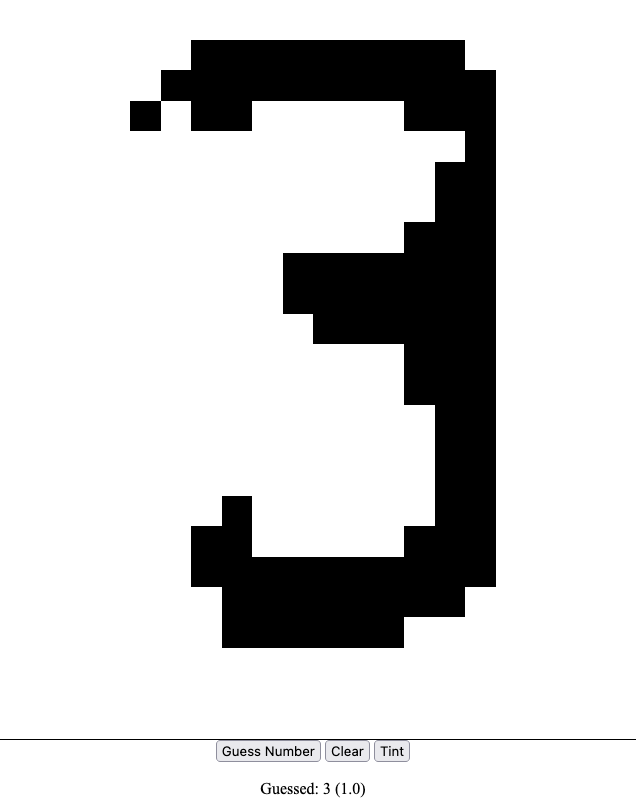

# Guess The Number
Draw with the mouse a number from 0 to 9 and machine learning model will guess the number.

The demo uses tensorflow for the prediction and raw webassembly for controlling the canvas




## Setup
```bash 
python3 -m venv .venv
source .venv/bin/activate
pip install -r requirements.txt
make run
```
## References:
- [Ben Smith Raw Wasm](https://www.youtube.com/watch?v=qEq3F9Z8z6w)
- [Mnist TensorFlow Tutorial](https://www.tensorflow.org/datasets/keras_example)